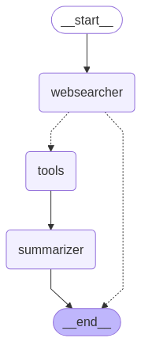

# Information Retrieval & Summarization Workflow

A simple system for information retrieval and summarization from the internet, vector database, and uploaded file.

## My Takeaway
- Use well-defined workflow instead
  - Agentic approach and tools calling are still very unreliable.
- Identify realistic use case first
  - Understand business logic / human task workflow -> identify steps that can leverage IT -> define IT workflow -> identify steps in IT that require ML / AI for better accuracy
- LLM is quite nice for docstring and documentation generation
  - generate draft -> verify and modify -> confirm changes -> update when necessary

## Use Cases
- Internet search + LLM
  - Research topics
    - ROI: Time saving from manually searching for information
    - Limitations: Cannot access articles behind paywall. Cannot differentiate slop from legitimate information, especially with more slops generated by AI nowadays.
    - Suggestions: Limit the information sources and give access to paid sources via API
- Summarization
  - Summarize articles, emails, meeting notes, etc.
    - ROI: Time saving from reading the whole content
    - Limitations: May still hallucinate
    - Suggestions: Minimize hallucination to an acceptable degree
- Vector Database search + LLM
  - Q&A from internal documents (FAQ, technical, laws, etc.)
    - ROI: Outsource repetitive questions to AI, hence save human resources.
    - Limitations: May still hallucinate
    - Suggestions: Minimize hallucination to an acceptable degree
  - Document search
    - ROI: Time saving from digging for relevant documents
    - Limitations: Retrieval is not 100% accurate
    - Suggestions: Use tags for more accurate and faster search
- Invoice data extraction
  - Invoice / chat / receipt / etc. data extraction
    - ROI: Remove time required for data entry
    - Limitations: Not 100% accurate
    - Suggestions: Manual verification still required

**Note**: Due to hallucination problem, always have a domain expert to verify the outputs. Showing the sources for validation helps.

## Features

### Sources
- **Internet**: General web information retrieval using DuckDuckGo
- **News Website**: News article search using DuckDuckGo
- **Vector Database**: RAG-based local document search
- **File Upload**: Read and retrieve information from uploaded file (currently only support PDF invoice reading)

### Key Components
- **Smart Search Routing**: Automatically selects the most appropriate search tool via AI agent
- **Vector Store Integration**: Efficient document indexing and similarity search
- **Intelligent Summarization**: Context-aware summarization (100-250 words)
- **UI with Streaming Updates**: Real-time response streaming in the UI
- **Invoice Reading**: Extract data from uploaded invoice with Layout Detection + OCR + LLM

## Architecture

The system follows a modular architecture with several key components:

### Agents
- **WebSearcher**: Interprets queries and coordinates search tool selection
- **Summarizer**: Processes search results into coherent summaries
- **Invoice Data Extractor**: Extract data from the structure-preserved OCR-ed invoice

### Models
- **Language Models**:
  - Qwen 3 (4B params) with AWQ quantization (default)
  - Qwen 2.5 (3B params) with AWQ quantization
  - SmolLM2 (1.7B params)
- **Embedding Model**:
  - Stella EN 1.5B v5

### Tools
- Internet and news search via DuckDuckGo
- Vector store retriever for document search
  - Tweaked for retrieving Malaysia Budget 2025 information.
  - Modify the description in the build_my_budget_retriever function in vector_store_retriever.py to accommodate for other type of documents.

## Workflow Graph


The workflow operates as follows:

1. WebSearcher agent processes the user query
2. Appropriate tools are selected and executed
3. Results are passed to the Summarizer agent
4. Final summary is presented to the user

**Note**: Invoice data extraction has a separate workflow.

## Installation

### Prerequisites
- Python 3.11 or higher
- CUDA-capable GPU (at least 12GB VRAM recommended)

### Setup
1. Clone the repository
2. Install dependencies:
   ```bash
   pip install -r requirements.txt
   ```
3. Install Chrome and ChromeDriver:
   - Download ChromeDriver from [Google Chrome for Testing](https://googlechromelabs.github.io/chrome-for-testing/)
   - Linux: Copy chromedriver to /usr/bin/

## Usage

1. Start the application:
   ```bash
   python src/app.py
   ```
2. Access the web interface (default: http://localhost:7860)
3. Upload documents or start chatting to search for information

## Documentation

1. Run:
    ```bash
    mkdocs serve
    ```
2. Access the documentation (default: http://localhost:8000)

## Evaluation

Not included in this repository but can be used as reference.

### LLM generated content can be evaluated using:

- **ROUGE scores**
  - A type of statistical method
  - Suitable for assessing the summarization quality
  - Not 100% reliable but good enough as an indicator with other metrics
- **BLEU scores**
  - A type of statistical method
  - Suitable for translation accuracy (note: this repo does not have translation feature)
  - Again, not 100% reliable but good enough as an indicator with other metrics
- **LLM as a judge**
  - Use a different LLM to give score on the quality of the generated content.
  - Not really reliable too.
- **Human Evaluation**
  - A more reliable approach, recommend to have a team of domain expert for evaluation.

**Note**: Recommeded approach
  1. Use statistical method and/or LLM as a judge as indicator during model improvement and tweaking.
  2. Once satisfied with the outcome, perform human evaluation.
  3. If not good enough, repeat from step 1. Else, finalize the model.

### Invoice data extraction

- **Precision**
  - Useful for measuring how many of the detection are wrong.
- **Recall**
  - Useful for measuring how many data are not detected.
- **F-1 Score**
  - Useful for measuring overall performance.